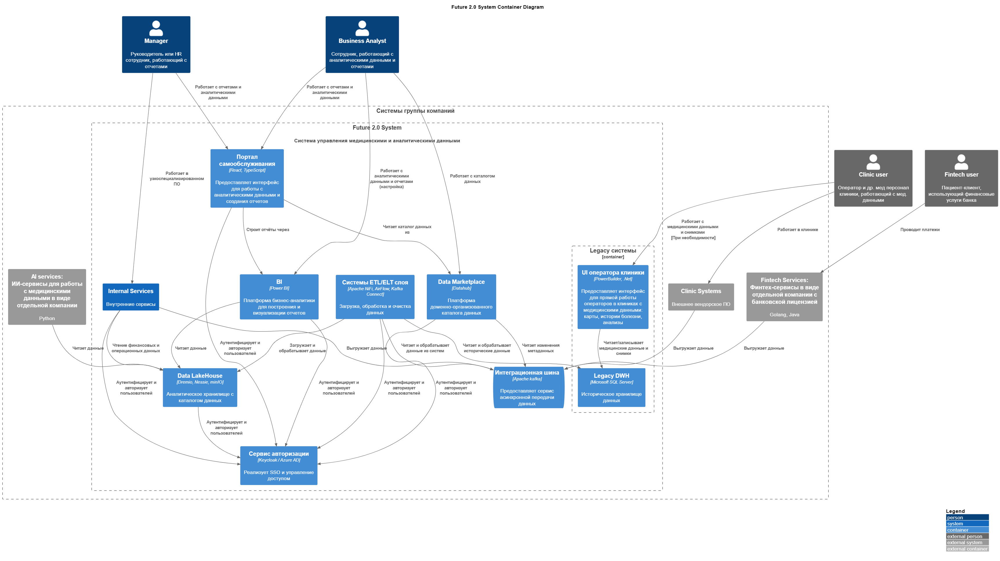

# Task1
## 1. Архитектура системы через год
### Диаграмма контейнеров в модели C4
[c4-сontainer-tobe.puml](c4-сontainer-tobe.puml)

## 2. Проблемные места текущей системы
- Низкая безопасность данных

    Вся информация разных доменов, в т.ч. медицинские данные, хранится в одном хранилище без тегирования, разграничения доступа к данным и аудита, что может привести к утечкам данных, штрафам и значительным репутационным потерям

- Использование устаревшей технологии для DWH

    DWH реализован на Microsoft SQL Server 2008, снятый с поддержки. Это создаёт риски отказоустойчивости и безопасности, а также не дает возможности дальнейшего масштабирования

- Единственное хранилище для всех данных под разные варианты использования

    Для разнородных задач (аналитика, ИИ-сервисы) нужны разные наборы и форматы данных, а также разные API работы с ними (file, JDBC), что требует большого количества трансформаций и значительно увеличивает сложность системы, а это в свою очередь уменьшает как TTM, так и производительность системы

- Отсутствие возможности создания собственных отчетов сотрудниками
    
    Отсутствие каталога данных и витрины ограничивает сотрудников существующим набором отчётов, расширить который можно только через обращение к выделенным специалистам, что затрудняет операционную и финансовую аналитику, а также оперативное принятие решений

- Использование ограниченной технологии для интеграционной шины

    Шина, реализованная на фреймворке Apache Camel, не способна обеспечить удобство и скорость интеграции между разными бизнес-доменами, требует отдельные ресурсы на её сопровождение и препятствует консолидации/переиспользованию больших объемов передаваемых данных

- Большое количество кастомной логики в BI

    Увеличивает сложность поддержки и сопровождения (индивидуальный подход к каждому отчету, вместо работы с источником "правды" данных), ограничивает масштабируемость на новые виды бизнеса (кастомизация как правило снижает гибкость, универсальность, т.к. затачивает логику под конкретные контексты бизнес-сценариев). Кроме того это вызывает проблемы с производительностью, т.к. выполнение любой логики требует время
   
## 3. Приоритизация выявленных проблем (по методу MoSCoW)
### Must have (Критически важные)
#### Низкая безопасность данных (необходимость внедрения централизованной авторизации)
- Обоснование: Работа с медицинскими и финансовыми данными требует строгого контроля доступа
- Риски: Утечка данных, несанкционированный доступ
- Влияние на бизнес: Критическое (репутационные и финансовые потери)
#### Единственное хранилище для всех данных под разные варианты использования
- Обоснование: Повышенные затраты на доработку и сопровождение. Взаимовлияние разных активностей DWH по производительности может привести к падению критичных операционных процессов.
- Риски: Задержки в получении операционных отчетов, невозможность масштабирования на новые бизнес-домены
- Влияние на бизнес: Критическое (прерывание бизнес-процессов, невозможность масштабирования бизнеса)
#### Отсутствие возможности создания собственных отчетов сотрудниками
- Обоснование: Нет возможности самостоятельно настраивать отчеты, что повышает зависимость от узконаправленных экспертов и снижает реактивность принятия решений бизнесом
- Риски: Замедление развития бизнеса в целом. Остановка бизнес-процессов в случае сбоев DWH
- Влияние на бизнес: Критическое (невыполнение прямого запроса бизнеса)
### Should have (Важные)
#### Использование ограниченной технологии для интеграционной шины
- Обоснование: Критична для работы всей системы, т.к. является центральным звеном по обмену информацией
- Риски: Нарушение обмена данными между системами. Невозможность подключить новые системы
- Влияние на бизнес: Значительное (нарушение бизнес-процессов, невозможность масштабирования бизнеса)
### Could have (Желательные)
#### Большое количество кастомной логики в BI
- Обоснование: Влияет на эффективность поддержки и скорость миграции на новые решения
- Риски: Высокие затраты на доработки и поддержку. Риски сбоев при миграции/доработках из-за неучтенной логики
- Влияние на бизнес: Среднее (повышенные затраты, прерывание бизнес-процессов при сбоях)
### Won't have (Не приоритетные)
#### Использование устаревшей технологии для DWH
- Обоснование: Данные Legacy DWH на SQL Server 2008 критически важны для ведения деятельности компании
- Риски: Потеря данных, нарушение работы бизнеса
- Влияние на бизнес: Критическое (остановка деятельности компании)
- Причина отказа от решения: Обновление на свежую версию по перечню рисков сопоставимо с миграцией на новое хранилище. С учетом задач от бизнеса и ограниченности ресурсов логичнее развернуть новое хранилище и постепенно смигрировать аналитику на него. При этом медицинские данные, которые не едут в аналитическое хранилище, позднее в рамках отдельного проекта смигрировать в отдельное хранилище с учетом повышенных требований к безопасности данных и ограничений по доступу