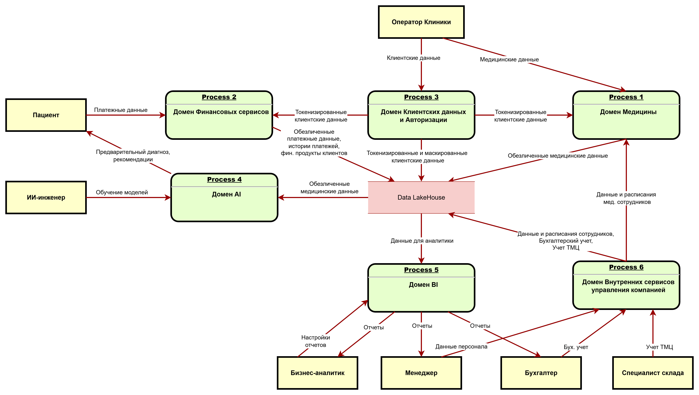

# Task2
## 1. Потоки данных между доменами
### DFD
[dfd.drawio](dfd.drawio)

## 2. Логика разделения на домены
Домены введены в соответствии с решаемыми бизнес-задачами, а также в ссоответствии с организационной структурой группы компаний, общим принципом разделения ответственности за функционал и данные.

Преимущества:
- независимость доработок, развёртывания, масштабирования и функционирования сервисов/систем в каждом домене => повышение отказоустойчивости, сокращение TTM и упрощение интеграции с новыми системами, в т.ч. за счет стандартизации API/контрактов доменов;
- выше эффективность бизнес-подразделений, за счет сосредоточения на своих продуктах, что также улучшает качество продукта и лояльность потребителей;
- соблюдение принципа Data Minimization, когда каждый домен отвечает за сбор, обработку и хранение только тех данных, которые ему необходимы, в соответствии с особенностями этих данных (например, медицинские данные нужны только в домене "Медицина" и в обезличенном виде в домене AI), что снижает риски безопасности и уменьшает объемы хранимых данных.

## Домен "Медицина"
#### Логика выделения:
- Основной бизнес компании, требующий наибаольшей экспертизы
- Высокие требования к безопасности и конфиденциальности данных
- Специфические регуляторные требования (медицинская тайна)
#### Преимущества:
- Изоляция медицинских данных (в т.ч. инфраструктурно)
- Независимое развитие медицинских сервисов
- Возможность сертификации по медицинским стандартам
### Домен "Финансовые сервисы"
#### Логика выделения:
- Отдельная организационная единица (купленная компания)
- Отдельная лицензия на банковскую деятельность
- Высокие требования к безопасности и конфиденциальности данных
- Специфические регуляторные требования
#### Преимущества:
- Изоляция финансовых данных
- Независимое развитие финансовых продуктов
- Соответствие требованиям регуляторов
### Домен "Клиентские данные и авторизация"
#### Логика выделения:
- "Единый взгляд" на клиента
- Переиспользование клиентских данных и сервисов авторизации другими доменами
- Централизованное управление клиентским опытом
- Специфические регуляторные требования
#### Преимущества:
- Единый профиль клиента, стандартизация
- Кросс-продажи между доменами
- Улучшение клиентского опыта
- Независимое развитие сервисов клиентского профиля
- Соответствие требованиям регуляторов
### Домен "AI"
#### Логика выделения:
- Высокие требования к передаче данных (отдельные API, данные)
- Отдельная инфраструктура специфичная под AI
- Специфическая для AI экспертиза команды
#### Преимущества:
- Контроль и оптимизация производительности передачи данных для обучения
- Усиленный контроль обезличенности данных
- Независимое развитие AI-сервисов
### Домен "BI"
#### Логика выделения:
- Централизованный доступ к данным для анализа
- Высокие требования к производительности аналитических запросов
- Единая команда сопровождения, позволяющая двигаться в сторону BIaaS
- Агрегации данных из всех доменов
#### Преимущества:
- Контроль и оптимизация производительности аналитических запросов
- Централизованное управление доступом к аналитике
- Аналитики = клиенты => повышение качества систем BI как отдельного платформенного продукта
### Домен "Внутренние сервисы управления компанией"
#### Логика выделения:
- Операционные системы (часто вендорские), не относящиеся к бизнес-доменам, но содержащие конфиденциальные данные (сотрудников, компании)
- Специфические регуляторные требования (к ведению, хранению, каналам связи)
- Другой профиль нагрузки и требований к отказоустойчивости
- Узконаправленная экспертиза
- Клиенты - внутренние сотрудники в отдельных организационных юнитах
#### Преимущества:
- Изоляция конфиденциальных данных
- Улучшение узконаправленного опыта без размывания фокуса на бизнес-домены
- Более эффективное управление ресурсами инфраструктуры
- Независимое развитие внутренних сервисов