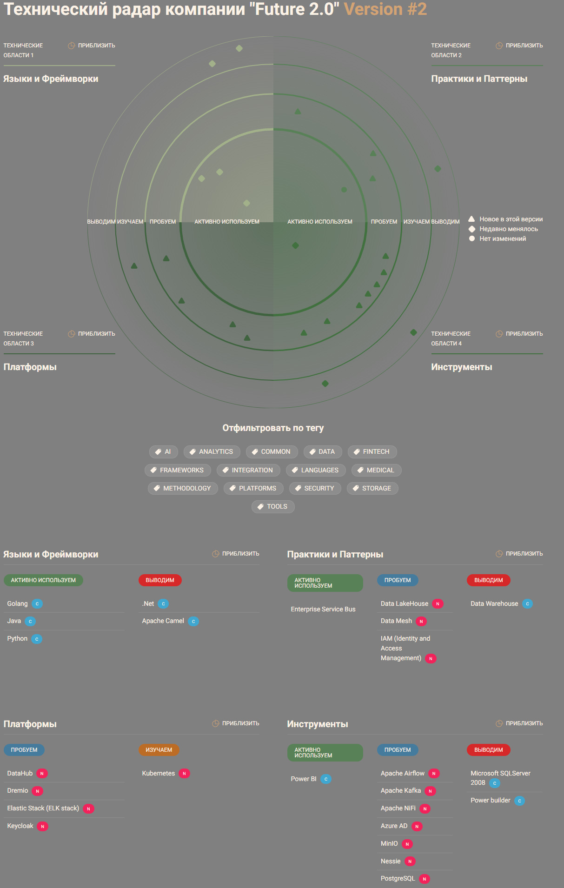

# Task3
## 1. Технический радар
### DFD
[techradar.jpg](techradar.jpg)



Для интерактивного запуска в браузере:

```
cd techRadar
npm run build
npm run serve
```

## 2. Роадмап изменений в технологическом ландшафте компании и его обносование
[roadmap.drawio](roadmap.drawio)

